

  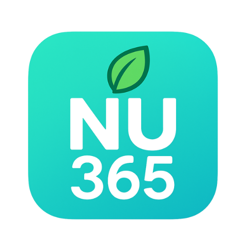

# nu365

**nu365** is a Flutter application that recognizes 12 popular food types from images and estimates their nutritional values (for reference only, not 100% accurate). The app helps users track their diet and raise awareness about daily nutrition.

## Recognizable Food Types

- Apple
- Banh mi (Vietnamese bread)
- Donut
- Egg
- French fries
- Fried chicken
- Goi cuon (Vietnamese spring roll)
- Milk
- Pizza
- Rice
- Shrimp
- Sushi

## Main Features

- **Login/Register**: User authentication, OTP support, and biometric security.
- **Food Scanning**: Identify food from images, return food name and estimated nutrition facts.
- **Meal History**: Save scanned meals, view detailed meal history.
- **Dashboard**: Nutrition statistics, charts, and summaries of calories, protein, fat, etc.
- **Profile Management**: View and edit personal information, manage security settings.
- **Advanced Security**: Two-factor authentication, biometrics, password change.
- **Modern UI**: Fresh, user-friendly design.

## App Screenshots

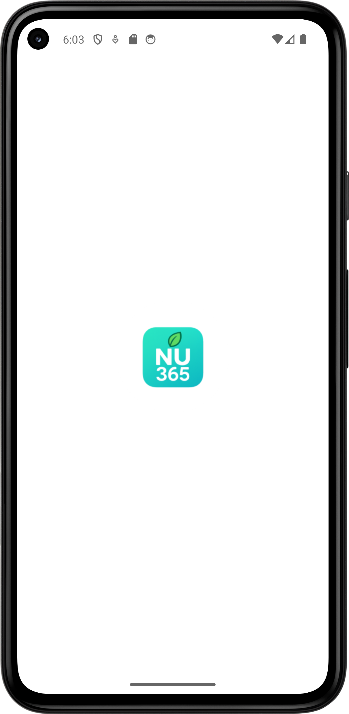

| 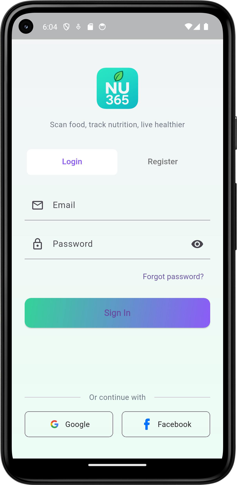 | 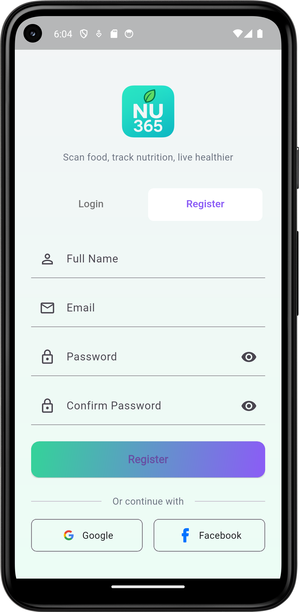 | 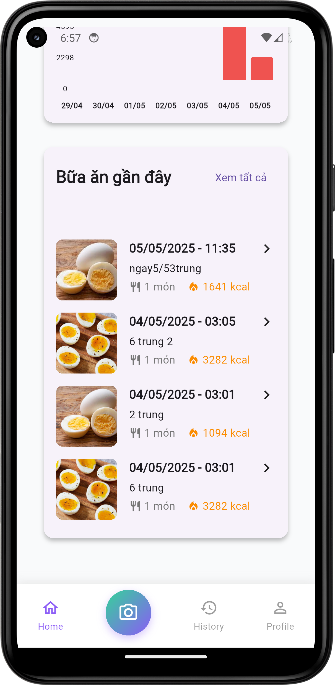 |  |
|:---:|:---:|:---:|:---:|
| Login | Register | Dashboard | Dashboard 2 |

| 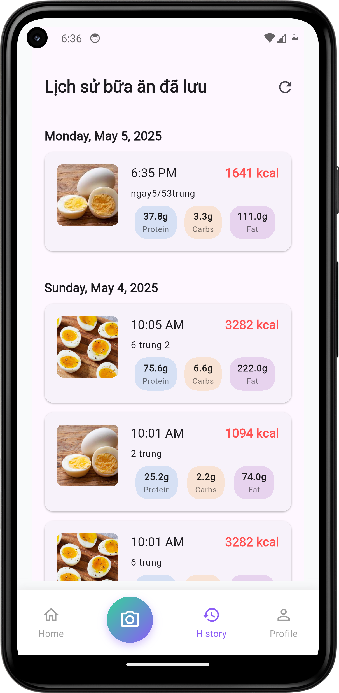 |  | 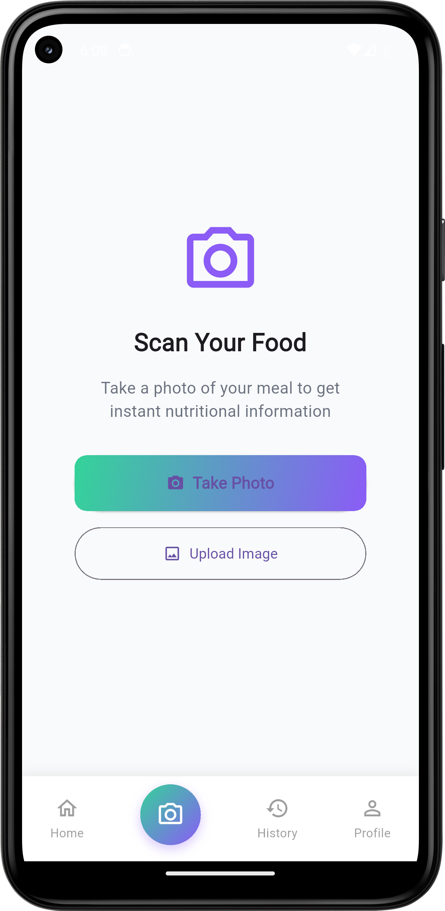 | 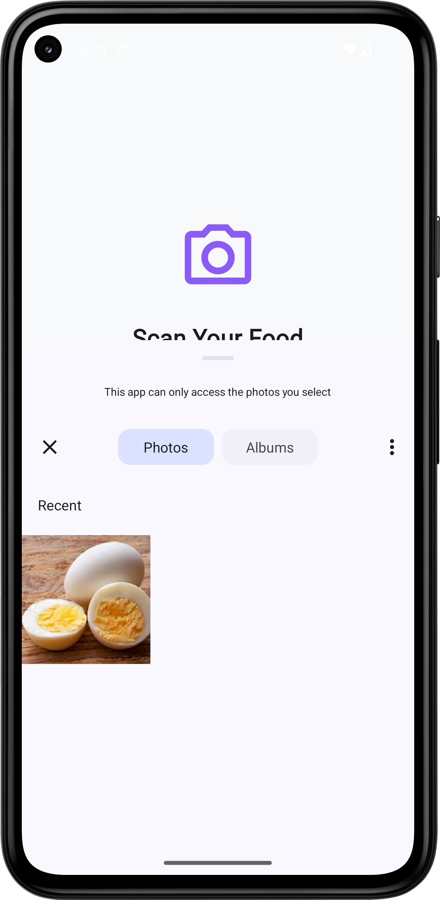 |
|:---:|:---:|:---:|:---:|
| Meal History | Meal Detail | Scan Feature | Pick Image Scan |

| 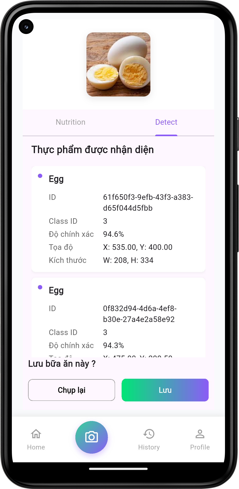 | 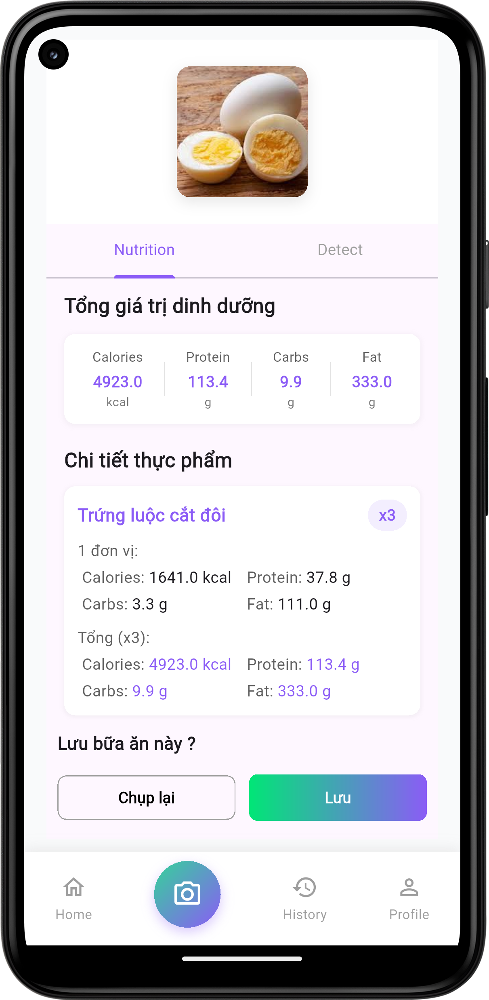 | 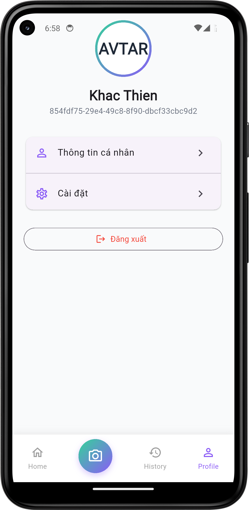 | 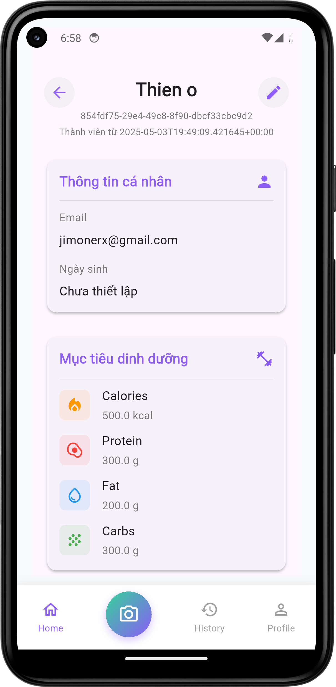 |
|:---:|:---:|:---:|:---:|
| Scan Result Info | Scan Result Nutrition | Profile | Profile Detail |

## Technologies Used

- Flutter, Dart
- Bloc, GetIt, GoRouter
- Supabase, ObjectBox, SQflite
- Camera, Image Picker, Local Auth, etc.

---

*Note: Nutritional values are for reference only and do not replace professional advice.*
